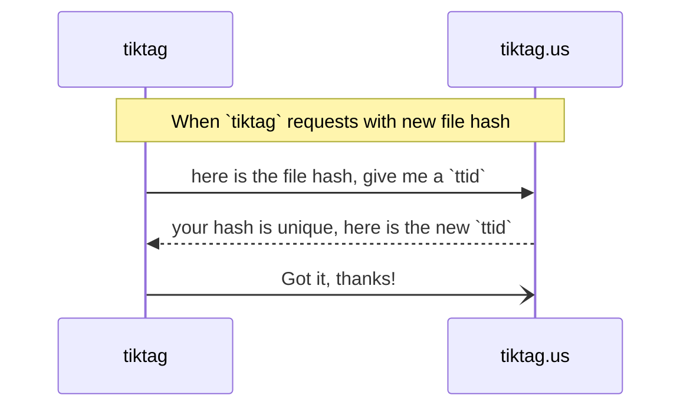
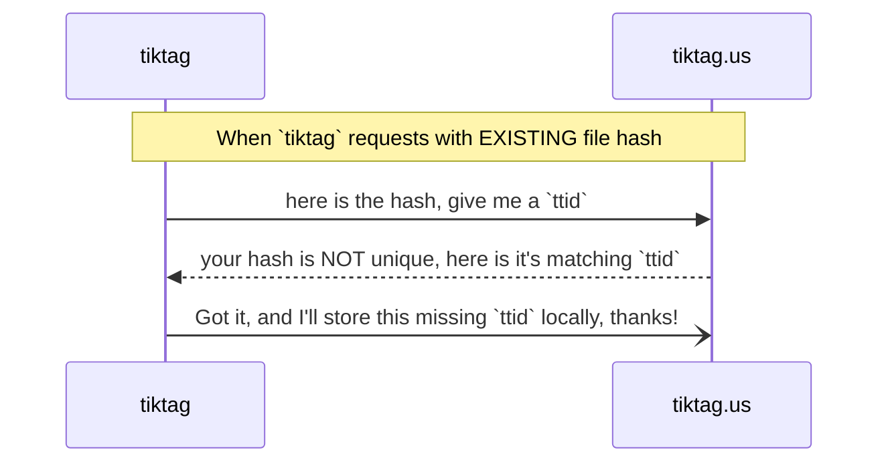

{}
  Developer docs are for authorized developers only in private repo https://github.com/tikoly-com/tiktag.us
  Content of this section is the same as this repo's `README.md`.
  End-user features and tutorials are documented on [the open source github repo](https://github.com/tikoly-com/tiktag).
{}

This specs are detailing the WHAT and HOW on `tiktag` design, user stories and the data objects to enable such design and user stories.

## User Journey (CLI)

> Below examples assume that the user is executing `tiktag` under the directory where the assets/files are stored. It's the recommended way of using `tiktag`.

In Tiktag v0.x, a user can do the following, 

1. **Host an image/photo** onto a S3 compaitable object storage service, so that the user can,
* store the asset for (blog) publishing, (authorized) sharing, and ownership change/sales (v1.x) 
  
  ```shell
  > tiktag myfilename.png
  > Tik ...Tag ... your asset is successfully hosted at,
  > https://s3.tikoly.com/village/563583552944996352.png
  ```

* search for asset (version) and see results
  
  ```shell
  > tiktag -f myfilename.png
  > Asset found at,
  > https://s3.tikoly.com/village/563583552944996352.png
  ```
  
   See [Specification](#specification) for full explanation. 
2. **Track the listing of hosted assets** on a local web GUI, typically on `https://127.0.0.1:3000`, so that she can
   * handle large numbers of assets with ease
   * copy/paste asset URL for publishing or sharing

> Note: Updating and deleting the photo/image is NOT the jobs of TikTag, which shall be done by other apps or the object storage's admin console.

## Specification

This section documents the specification and requirements on how we implement _TikTag_. As a convention, `tiktag` refers to the CLI app, while `tiktag.us` or _TikTag_ refers to the hosted services on [tiktag.us](https://tiktag.us).


1. At the core of `tiktag` design, `ttid` and the file's `hash` are ALWAYS 1:1 related. Even 1 pixel change to an asset/file will trigger a new `ttid` generation to represent the asset's new version. 
2. `tiktag` CLI (data set on local instance) constantly have differences from data set on `tiktag.us`, which is by design and the key concern for auditing.
3. Baesd on 1 and 2, `tiktag` can always check if either a file's hash or `ttid` is unique or not, either locally or on the cloud.



Diagrams below are [in Mermaid syntax](https://mermaid.js.org/syntax/sequenceDiagram.html). You can use MarkText to view their graphical mode.


### CRUD on Assets

By design, `tiktag` works on digital assets in very opinionated ways, such as _updating_ or _removing_ assets means very specific operations on the assets.

#### Create / host an asset

Creating an asset is as simple as the following CLI example shows, 

```Shell
> tiktag myfilename.png
> Tik ...Tag ... your asset is successfully hosted at,
> https://s3.tikoly.com/village/563583552944996352.png
```

What happens under the hood,

1. `tiktag` makes a hash of `myfilename.png` and requests an `ttid` from tiktag.us
   * `tiktag` checks the hash against the local db to see if it's unique,
   * if the hash is unique locally, it goes ahead with the request for a new `ttid`,   
   * if it's NOT unique locally, executing `tiktag myfilename.png` is equivalent to `tiktag find myfilename.png`, ends up returning the asset's URI, i.e., `https://s3.tikoly.com/village/563583552944996352.png`.



2. `tiktag.us` receives the file's hash and generate a `ttid` as reponse to `tiktag` CLI, while storing them on cloud (indexed by `ttid`);
   * if `tiktag` sends a file's hash it considered locally unique to `tiktag.us` (but in fact NOT unique in `tiktag.us`), here is what happens,



3. `tiktag` receives the new `ttid` form `tiktag.us` and store it with the file's hash locally (indexed by `ttid`);
4. `tiktag` reads the object storage's params from `config.yml` and tries to send it over for storage;
5. `tiktag` receives `success` response from object storage, and outputs the final result to user, i.e., `https://s3.tikoly.com/village/563583552944996352.png`
6. (If) `tiktag` receives `error` response from object storage, then it pauses the workflow and throw errors,
   * `tiktag` shall store partially finish operation/transaction and allow user to repeat the same command after errors are fixed, until it works

```Shell
> tiktag myfilename.png
> Oops...storage error, please correct it and try again.
```


1. Changing object storage params in `config.yml` will cause `tiktag` to automatically update all locally stored assets' URIs, which are NOT the job by `tiktag.us`, by design.
2. After new object storage is defined, user must execute `tiktag sync` to re-sync (upload) all assets onto the new storage services


#### Read / find an assest

#### Update an asset

#### Remove an asset

### Service APIs

（介绍 gRPC 服务和客户端交互和设计、需求等）

### Auditing APIs

（设计思路，v1.x）

### API Provisioning

（接口安全规范、流量规则和基本要求等，防止被 DDOS / 滥用）

## Data Objects

In its essence, OMail tracks `user` interaction with different `TTID` requested and auto-generated by OMail.  Hence it's forming relations between these 2 objects as people are using OMail to track their written letters. There are TWO types of user interaction with `TTID`

All interesting and meaningful OMail events take the form of "User did X to TTID Y". For example, user A requested a new `TTID` and `2uk24a` was generated, which can be shared off-line or online with someone else (or user B), who in turn uses OMail to verify the existence of something this `TTID` represents -- leaving a `# of views` record with this `TTID`.

- `TTID`, 6 digit hash (the most important object in OMail)
  - Auto-generated when requested (limit to ONE TTID per day), for labeling a letter (for example)
  - Root object for extended uses, such as  for tracking `# of click/scan` per TTID
  - Either mobile browser or a Scan3 scanner can scan the barcode or QR form of `TTID`
  - Anonymous user can request `TTID` but only ONE per day, and anon user can scan/track `TTID` with limited status (anonymized)
  - Unclaimed `TTID` can be claimed by any one who knows it and claims it first
  - Once claimed by the 1st signed up `user`, `TTID` `belongTo` this `user`, who can also view full stats related to this `TTID`.
- `userId`, generated UUID + external ID, such as OAuth provider id.
  - OAuth/Social login (web2) supported by default, optionally web3 / wallet login

### Object Dictionary

List of key data objects in TikTag,

- `ttasset`, top level noun / object with properties below,
  - `ttid`, TikTag ID, unique ID for each file/image/object, also as its filename, i.e., `563583552944996352.png`
  - `ttidhash`, the hash of the asset/file, for cryptographic verification of the file's integrity/version
  - `filename`, original filename of a photo/file, whatever it is
  - `fileext`, file extension name, such as `.png`, `.jpg`
  - `tturl`, TikTag URL of a hosted file/photo, i.e., `https://s3.tikoly.com/village/563583552944996352.png`
    - it's constructed like, `{TargetURL}/{TargetBucket}/{ttid}.{fileext}`
    - `tiktag.us` may need to store this value in later versions to enable transaction logging among different owners
  - `dir`, local directory where the asset is stored on the user's PC
- S3 (MinIO) related,
  - `TargetURL`
  - `AccessKey`
  - `SecretKey`
  - `TargetBucket`


TikTag promotes clear ownership and seperation of auditing concerns. `tiktag` locally stores many objects that are NOT and will NOT be stored on `tiktag.us`, the cloud service. Below is a chart on the shared and the differences.


| Data Objects     | DB of `tiktag`       | Cloud DB of `tiktag.us` |
|------------------|----------------------|-------------------------|
| `ttasset`        | - | - |
| - `ttid`         | yes                  | yes                     |
| - `ttidhash`     | yes                  | yes                     |
| - `filename`     | yes                  | yes                     |
| - `fileext`      | yes                  | yes                     |
| - `tturl`        | yes                  | NO                      |
| - `dir`          | yes                  | NO                      |
| `s3`             | NO, read from `config.yml` | NO                |

### Object Relations

* `tiktag` v0.x series are NOT supporting wallet login and is only a CLI app.
* Starting with `tiktag` v1.x, we'll explore good designs and implementation on how crypto wallets, such as FuturesCash or Sui Wallet can be integrated via a combination of CLI app and easy to handle web GUI for TikTag.

#### Anon Users vs. TTID

* Anon users can scan QR to visit `omail.tikoly.com` to request `TTID` and use it for labeling hard-copies / letters.

* `TTID` generated by anon user is `unclaimed`, and hence running the risks of being `claimed` (owned) by any signed-up user who's found/knew of this `TTID`, hence pushing any users who care about their OMail ID ownership to sign up and claim whatever `TTID` she've generated.

* `unclaimed` `TTID` also facilitates sharing of low value physical objects / hard-copies 

#### Signed-up Users vs. TTID

* Signed-up users (web2 or web3) who's claimed some `TTID` can enjoy more benefits of OMail: 
  
  * a) `TTID` as ownership certificate, which can be verified by OMail (on-line or face-to-face);
  
  * b) the potential to mint NFT (via API to NFT marketplaces)

#### Anon Users vs. Signed-up Users

* Any flexible uses of OMail that can facilitate the sharing of physical objects labeld with `TTID`.
